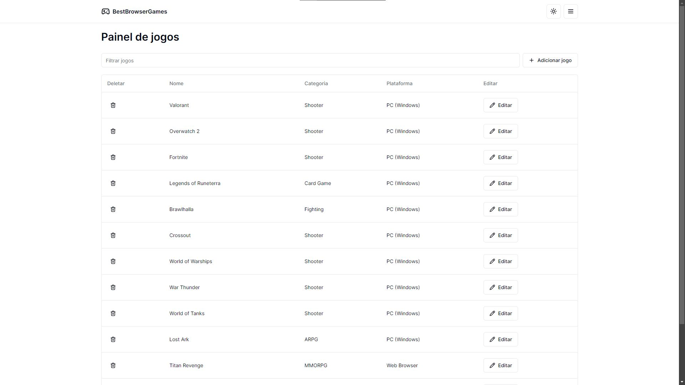
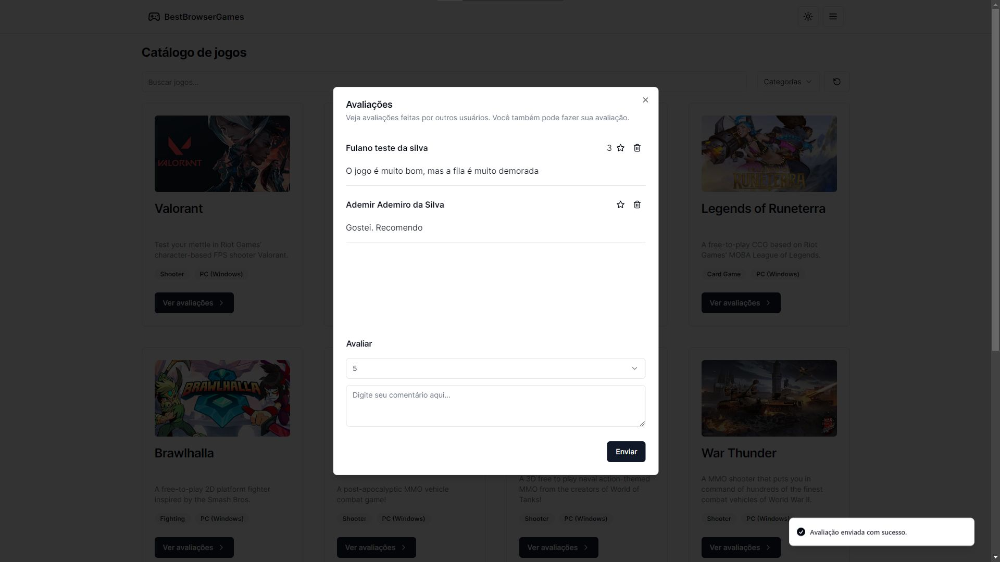
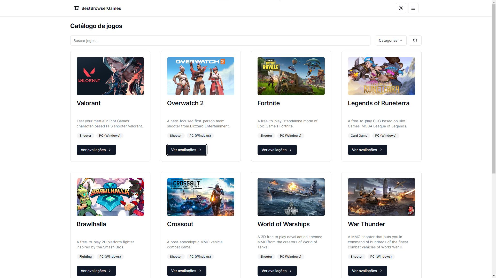
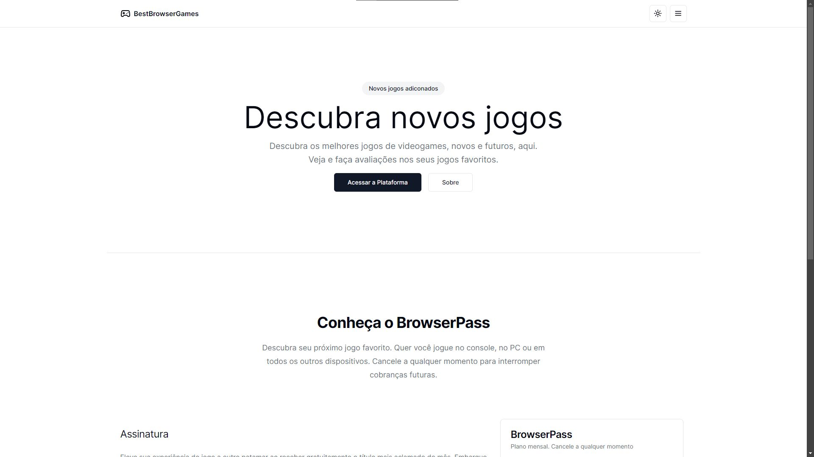

# Best Browser Games

This project is a game review platform built with React.js. Users can review games, and administrators have the ability to add, edit, and remove games from the platform.

## Preview

## Features

User Reviews: Users can share their thoughts and rate games.
Admin Controls: Administrators can manage the game library, including adding new games, editing existing games, and removing games.

## Tech Stack

React.js: A JavaScript library for building user interfaces.
shadcn/ui: A UI library used for building the user interface components.
Tailwind CSS: A utility-first CSS framework for rapidly building custom user interfaces.

## Project Structure

The main application entry point is src/main.jsx. The application's components are located in src/components, and the application's routes are defined in src/routes. The application's styles are defined in src/index.css and configured with tailwind.config.js.

## Getting Started

To get started with this project, clone the repository and install the dependencies with npm install. Then, start the development server with npm run dev.

Please refer to the individual files and components for more detailed information.

## Deploy and Preview

To deploy and preview the project, follow these steps:

1. Build the project using the command: npm run build.
2. Deploy the built files to your hosting provider.
3. Access the deployed website to preview the project.

## Contributing

Contributions are welcome. Please open an issue or submit a pull request for any changes.

## License

This project is licensed under the MIT License.
